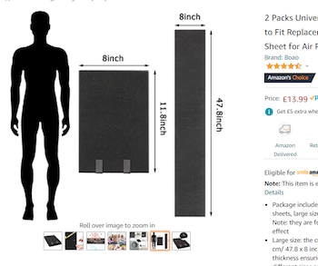
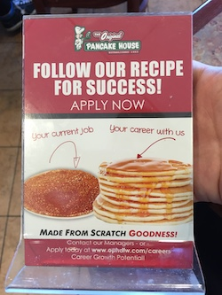
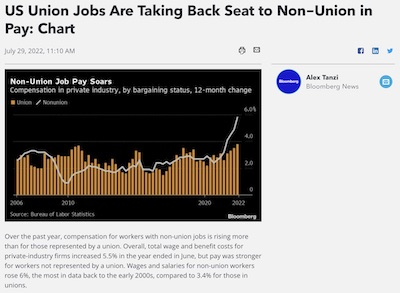
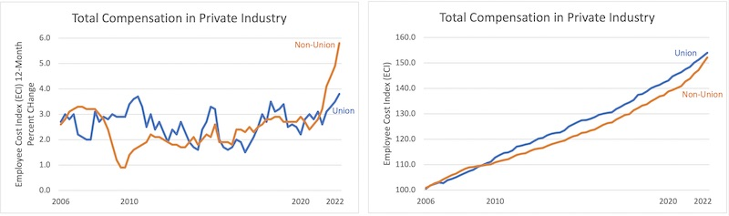
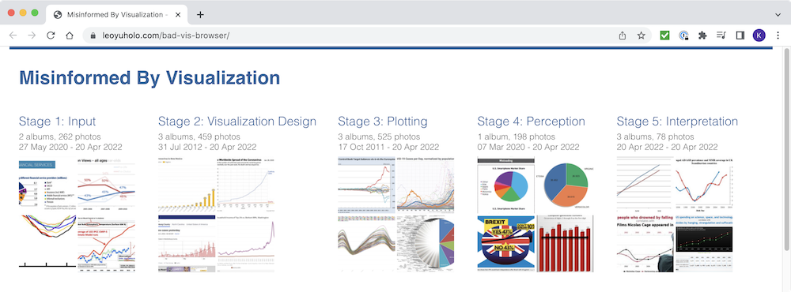
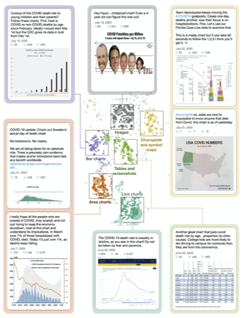

# VisLies 2022 Gallery

After two years of having to meet through cameras and screens, we were
finally able to meet in person for VisLies again.

## Not to Scale

[Ken Moreland] started out with a fun example from an [amazon.com product
page for carbon filters]. As with most listing, several pictures are
provided for the product. One of the pictures, shown here, is dedicated to
demonstrating the size and provides a silhouette of a person to help with
scale.

At first glance, the filter pads look huge. The pad is nearly half the
height of a person. But wait. If we look at the actual dimensions of the
pad, we see that the pad is only about a foot tall. Either the sizes of the
pad and the person are not to scale, or that person is only a couple of
feet tall.

On top of that, there is a second view of the pad, unfolded this time. The
unfolded pad is labeled at about 4 feet tall. That is clearly not at the
same scale as the folded pad, and also shorter than the average adult.

None of the three items in this picture are to scale with each other, and
human silhouettes are not part of what is being sold. Thus, the only
function the person serves in this picture is to make the product look
larger than it actually is.

[Ken Moreland]: https://www.kennethmoreland.com/
[amazon.com product page for carbon filters]: https://www.amazon.com/Universal-Activated-Replacement-Purifiers-Conditioner/dp/B087M45SL5/ref=sr_1_1

## Pancake Success

While visiting a breakfast restaurant, [Ken][Ken Moreland] came across this
compelling advertisement to work there. It features a visualization that
uses two stacks of pancakes to compare an average job with a job at the
restaurant.

Using pancakes as a physical manifestation of a bar chart is not
unreasonable (although the image could be better about getting the size and
orientation of the pancakes more consistent). Of course, the advertisement
is not actually referring to pancakes but rather a notional concept of career
satisfaction. The idea that life success could be quantified in a single
number, particularly when there is no way to know anything about the
reader's career, is comical.

Or maybe the advertisement is talking about physical pancakes. A pancake
restaurant would almost certainly involve more pancakes than his current
job. As compelling as this argument is, [Ken][Ken Moreland] decided to
stick with his current career.

## Union Pay

[A recent article in Bloomberg Law][Bloomberg article] showed this recent
plot that the title claims suggests "union jobs are taking a back seat."
The plot certainly shows in recent years the non-union pay being larger
than unions, but the claim struck [Ken][Ken Moreland] as a little odd.

The plot itself does not have anything overtly wrong with it. Although the
asymmetric representation of union data (bars) and non-union (line) is a
a bit strange, there is nothing particularly misleading about it. And the
data time range, which goes from present back over 15 years, is not cherry
picked.

The real problem here is not with the plot itself but with the title. A
common subtle theme at VisLies is using a visualization to draw a
conclusion that is unsupported by the data. In this case, the plot is
showing the _change_ in worker pay, not the total pay. Just because the
white line is over the tan bars, it is not necessarily the case that
non-union workers are paid more than union workers.

[Ken][Ken Moreland] wanted to take a closer look. The [Bloomberg article]
reports that the data comes from the [U.S. Bureau of Labor Statistics].
[Ken][Ken Moreland] pulled the numbers from the same database and [plotted
both the change and total worker pay].

The left plot replicates that in the [Bloomberg article]. The right plot
shows the total pay from the same database.[^scale] As we can see in the right
plot, union jobs still, on average, pay more than their non-union
equivalent.

[Bloomberg article]: https://news.bloomberglaw.com/daily-labor-report/us-union-jobs-are-taking-back-seat-to-non-union-in-pay-chart
[U.S. Bureau of Labor Statistics]: https://www.bls.gov/ncs/
[plotted both the change and total worker pay]: compensation-union-v-nonunion.xlsx

[^scale]: We should point out that this plot of total pay has a vertical
    scale that does not go down to zero. This was done to make it easier to
    see the difference between the two line series. But note that, as we
    often criticize during VisLies, this also exaggerates the difference.

## For Further Reading

The last couple of years have brought some serious scientific research
relevant to VisLies. The first of these is "[Misinformed by Visualization:
What Do We Learn From Misinformative Visualizations?]" by Lo, Gupta,
Shigyo, Wu, Bertini, and Qu. The authors collected a large corpus of
visualizations marked as flawed on social media. They systematically
sampled and reviewed these visualizations and propose a taxonomy to
classify misleading visualizations. In addition to the paper itself, the
authors helpfully make available a [bad vis browser] that readers such as
ourselves can mine for VisLies. They also provide [their whole flawed
visualization corpus] for an even deeper dive.

[Misinformed by Visualization: What Do We Learn From Misinformative Visualizations?]: https://dx.doi.org/10.1111/cgf.14559
[bad vis browser]: https://leoyuholo.com/bad-vis-browser/ 
[their whole flawed visualization corpus]: https://osf.io/wghxd/ 

Another relevant publication is "[Viral Visualizations: How Coronavirus
Skeptics Use Orthodox Data Practices to Promote Unorthodox Science Online]"
by Lee, Yang, Inchoco, Jones, and Satyanarayan. This paper analyzes
visualizations from twitter feeds in "anti-mask" communities. The paper
finds that, surprisingly, these communities respected and mimicked science
principles while simultaneously rejecting the science community. There was
a strong focus on data access and analysis as well as a promotion of
correct visualization techniques.

At the same time, the forums rejected analysis from experts. This served to
isolate the community from contrary positions and allowed them to ignore or
reject contrary evidence. The end result was many compelling, but
ultimately incorrect, visualizations.

[Viral Visualizations: How Coronavirus Skeptics Use Orthodox Data Practices to Promote Unorthodox Science Online]: https://dx.doi.org/10.1145/3411764.3445211

----
