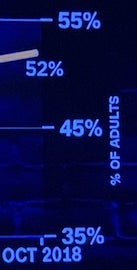

# VisLies 2022 Gallery

After two years of having to meet through cameras and screens, we were
finally able to meet in person for VisLies again.

## Not to Scale

[Ken Moreland] started out with a fun example from an [amazon.com product
page for carbon filters]. As with most listing, several pictures are
provided for the product. One of the pictures, shown here, is dedicated to
demonstrating the size and provides a silhouette of a person to help with
scale.

At first glance, the filter pads look huge. The pad is nearly half the
height of a person. But wait. If we look at the actual dimensions of the
pad, we see that the pad is only about a foot tall. Either the sizes of the
pad and the person are not to scale, or that person is only a couple of
feet tall.

On top of that, there is a second view of the pad, unfolded this time. The
unfolded pad is labeled at about 4 feet tall. That is clearly not at the
same scale as the folded pad, and also shorter than the average adult.

None of the three items in this picture are to scale with each other, and
human silhouettes are not part of what is being sold. Thus, the only
function the person serves in this picture is to make the product look
larger than it actually is.

[Ken Moreland]: https://www.kennethmoreland.com/
[amazon.com product page for carbon filters]: https://www.amazon.com/Universal-Activated-Replacement-Purifiers-Conditioner/dp/B087M45SL5/ref=sr_1_1

## Pancake Success

While visiting a breakfast restaurant, [Ken][Ken Moreland] came across this
compelling advertisement to work there. It features a visualization that
uses two stacks of pancakes to compare an average job with a job at the
restaurant.

Using pancakes as a physical manifestation of a bar chart is not
unreasonable (although the image could be better about getting the size and
orientation of the pancakes more consistent). Of course, the advertisement
is not actually referring to pancakes but rather a notional concept of career
satisfaction. The idea that life success could be quantified in a single
number, particularly when there is no way to know anything about the
reader's career, is comical.

Or maybe the advertisement is talking about physical pancakes. A pancake
restaurant would almost certainly involve more pancakes than his current
job. As compelling as this argument is, [Ken][Ken Moreland] decided to
stick with his current career.

## Union Pay

[A recent article in Bloomberg Law][Bloomberg article] showed this recent
plot that the title claims suggests "union jobs are taking a back seat."
The plot certainly shows in recent years the non-union pay being larger
than unions, but the claim struck [Ken][Ken Moreland] as a little odd.

The plot itself does not have anything overtly wrong with it. Although the
asymmetric representation of union data (bars) and non-union (line) is a
a bit strange, there is nothing particularly misleading about it. And the
data time range, which goes from present back over 15 years, is not cherry
picked.

The real problem here is not with the plot itself but with the title. A
common subtle theme at VisLies is using a visualization to draw a
conclusion that is unsupported by the data. In this case, the plot is
showing the _change_ in worker pay, not the total pay. Just because the
white line is over the tan bars, it is not necessarily the case that
non-union workers are paid more than union workers.

[Ken][Ken Moreland] wanted to take a closer look. The [Bloomberg article]
reports that the data comes from the [U.S. Bureau of Labor Statistics].
[Ken][Ken Moreland] pulled the numbers from the same database and [plotted
both the change and total worker pay].

The left plot replicates that in the [Bloomberg article]. The right plot
shows the total pay from the same database.[^scale] As we can see in the right
plot, union jobs still, on average, pay more than their non-union
equivalent (for now).

[Bloomberg article]: https://news.bloomberglaw.com/daily-labor-report/us-union-jobs-are-taking-back-seat-to-non-union-in-pay-chart
[U.S. Bureau of Labor Statistics]: https://www.bls.gov/ncs/
[plotted both the change and total worker pay]: compensation-union-v-nonunion.xlsx

[^scale]: We should point out that this plot of total pay has a vertical
    scale that does not go down to zero. This was done to make it easier to
    see the difference between the two line series. But note that, as we
    often criticize during VisLies, this also exaggerates the difference.

## Eying the Hurricane

[Bernice Rogowitz] presented this map of Florida showing the storm surge
for Hurricane Ian. The extent of the surge is shown as overlapping regions
on the map and the color, presumably, indicates the height of the storm
surge, since adjacent color coded labels are provided. However, if you look
at the values, you can see that they don't map onto the surge heights
uniquely.

Here is a colored table to examine the ranges. The color green, for example,
shows the range indicated for each region. The first green region indicates
1-4 feet, so the first row colors the cells 1-4 green, etc. 1 and 2 feet
are reliably colored green, but 3 ft could be green or yellow, 4 feet could
be green yellow or orange, 5 feet could be yellow, orange or red.

With the table in place it becomes a bit more clear what the colors mean.
The color indicates a _maximum_ value. So the three green regions could be
at max 4 feet, so green, yellow at 5, so yellow, and orange at 8, and red
at 10. But, why not say so?

[Bernice Rogowitz]: https://sites.google.com/site/bernicerogowitz/

## Mixed up Colors

The modest scatter plot. A great way to show relationships of data in 2
dimensions. But what about more complex relationships with more
measurements?

No worries! To solve these problems, [Eager Pies] presents the _3D Stacked
Scatter Pie Columns_. The scatter plot is enhanced by creating sized
stacked bars in the third dimension. To maximize the amount of information,
a pie chart is placed on the top of each bar.

Unfortunately, cramming all these features together is problematic.
Converting the scatterplot into a 3D space makes it harder to understand
their relationship to each other. 3D visualizations also bring up the
problem of occlusion where one object cannot be seen because it is in front
of another. This visualization gets around the occlusion problem by making
the bars transparent. But as [Bernice][Bernice Rogowitz] explains,
transparent colors come with their own problems.

When bars overlap, you get transparent color mixture. There are 3 main
values depicted (blue, yellow red), and three additional values introduced
on the top section of each cylinder (green, violet, and peach). Even within
a single cylinder, there are problems. The blue and yellow bars, when seen
in this projection, overlap at their projected intersection, producing
green. Green is an artifact and has no semantic meaning. When two bars
overlap, the number of extra colors increases, totally obfuscating the
numerical meaning.

Although this plot is presented in satire, it demonstrates how adding more
visual elements does not always add more information. That said,
unintentional color mixing can happen with the best of intentions.

Consider these [maps of the distribution of immigrants in the United
States]. Props to the designers of these maps for providing such a detailed
distribution of immigrant population. Perhaps too detailed. Because these
dots are so small and dense the colors blend together. This blending could
be caused by subsampling of pixels, image compression artifacts, or simple
natural blurring in your eye. At any rate, the color mixing yields colors
like greenish hues that are not even part of the color legend.

This is because when colors mix, they do not, perceptually, retain the
properties of the colors that form them. They form a completely new color.
This is because, based on [trichromatic theory], different mixes of light
wavelengths can combine into the same colors. So, any color can be mixed
with 3 primaries, but there is an infinite number of triplets that could
have produced that resulting color.

[Eager Pies]: http://eagerpies.com/better-than-minard/ [maps of the distribution of immigrants in the United States]: https://mapsontheweb.zoom-maps.com/post/689861452680626176/the-changing-geography-of-immigration-in-the-us
[trichromatic theory]: https://www.simplypsychology.org/what-is-the-trichromatic-theory-of-color-vision.html

## Venn-ish Diagrams

[Dave Pugmire] usually finds stupid things to bring to VisLies, and we
love them. He started with this Venn diagram [created by Scott Walker],
former governor of Washington.

Well, we use the term "[Venn diagram]" loosely here. This thing looks like
a Venn diagram, and is clearly supposed to be one. But it is not. A Venn
diagram is supposed to represent things that belong exclusively to one set,
exclusively to the other set, and then the intersection of things that
belong to both sets. But look at the lists in the two sides of the diagram.
They list the exact same things. So this diagram shows the things common to
both in the middle and then the things that are common to both on the left
and things that are common to both on the right.

This ridiculous infographic did not go by unnoticed. Unsurprisingly,
[Governor Walker was roasted on social media]. Along with the ridiculing
came some "helpful" fixes. Here is one of our favorites.

[Dave Pugmire]: https://csmd.ornl.gov/profile/dave-pugmire
[created by Scott Walker]: https://www.jsonline.com/story/news/blogs/wisconsin-voter/2018/12/22/loss-support-broad-set-cities-suburbs-walkers-undoing/2386626002/
[Venn diagram]: https://en.wikipedia.org/wiki/Venn_diagram
[Governor Walker was roasted on social media]: https://www.jsonline.com/story/news/politics/2018/12/14/gov-walker-gets-flack-social-media-his-venn-diagram/2313051002/

## COVID-19 Irregularities

Lily Ge presented this gem of a chart. The chart is simple enough. It
provides the day-to-day trends of COVID-19, compiled in the early days of
the pandemic.

But look closely at the vertical axis and you will see something odd. The
lines on the axis are labeled "30, 60, 90, 100, 130, 160, 190, 240, 250,
300, 350, 400." The spacing between the numbers is entirely inconsistent.
The spacing goes from 30 to 10, back to 30, then to 50.

This screen capture has made its rounds on social media and has been
noticed in other blogs such as by [Stephanie Glen] and [Victor Piercey].

We can speculate on the reasons for such shenanigans with the axis. But it
is unclear what point might be made by altering the spacing. Likely this is
just sloppiness.

[Stephanie Glen]: https://www.datasciencecentral.com/the-worst-covid-19-misleading-graphs/
[Victor Piercey]: https://www.utdanacenter.org/blog/quantitative-literacy-time-covid-19

## A Feast of Pies

[Pie charts] and related displays are a common theme at VisLies. Apart from
pie charts having some [dubious features], the base metaphor and visual
elements are frequently misused and abused.

[Ken Moreland] identified a group of problematic pie charts. The first of
these is this chart presenting the results of a survey of the North
America's favorite pies. The premise of the "real pie chart" that uses
pictures of real pie slices for the wedges of the chart is cute if a little
distracting.

But you might notice that the numbers do not seem to match the proportional
sizes of the slices. For example, the "Apple" slice is labeled "47%", which
should be nearly half the pie. But that is clearly not the case.

The text around the chart explains why this is. The participants of the
study were asked for their _three_ favorite pies. The chart numbers are not
giving the percentage of votes cast, but rather the number of participants
that voted for the pie. Since each person gets 3 votes, the total
percentage of votes adds up to 300%. As the fine print on the bottom says,
the three votes per participants means that the total number of votes adds
up to more than 100%.

Having the pie represent greater than 100% breaks the basic metaphor of the
pie chart, which is showing parts of a whole. A whole is 100%, so showing
the proportion of votes rather than voters would be much less confusing.
But even if we were to accept the concept that the whole is 300%, the chart
is still wrong. The numbers don't add up to 300% either. They add up to
271%. People must have voted for pies that did not make this top ten list.
Not listing the least significant values in a pie chart is common as too
many thin slices can make the chart less readable. But when this is done,
the remaining categories should be grouped into an "other" slice to ensure
that the proportions of the other slices are correct.

We now take your pie and add a doughnut of nonsense. Here the numbers add up
to 100%, so at least that is good. But, hey, that 1% slice looks awfully
big. And why does 8% take up half of the chart?

So, yeah. None of these slices are proportional to the number. On top of
that, the numbers seem suspect. How is it possible that more people are
getting Master's degrees than Bachelor's degrees? Unfortunately, the
[original post] doesn't put the chart in context, and the labels are not
clear enough.

Now we see your doughnut of nonsense and remove the color. The proportions of
these slices are also off. For example, the lower-left slice is clearly
less than 25%.

But now the chart has been poorly copied enough times that the color is
removed and it is impossible to know which number goes with which category.
We also notice that the legend only has 4 categories whereas there are 5
slices. It might be the case that one of the categories got cut off the
picture. In any case, both the color and the cropping would be less of an
issue if the labels were placed with the chart slices themselves rather
than in a separate legend.

[Pie charts]: https://en.wikipedia.org/wiki/Pie_chart
[dubious features]: https://www.perceptualedge.com/articles/visual_business_intelligence/save_the_pies_for_dessert.pdf
[original post]: https://www.reddit.com/r/CrappyDesign/comments/fi0x1t/somewhat_misleading_graph/?utm_source=share&utm_medium=ios_app&utm_name=iossmf
[black and white doughnut]: https://www.reddit.com/r/CrappyDesign/comments/paa5ki/thank_you/?utm_source=share&utm_medium=ios_app&utm_name=iossmf

## Problematic Crime

VisLies often features less than accurate charts presented by TV news
programs. So it comes as no surprise that [Ken][Ken Moreland] found this
gem [posted on social media]. At first glance, this plot seems innocuous.
But the more you look at it, the more problems you find. Nearly every
element of this chart is incorrect, and it might be the worst chart we have
ever seen.

&nbsp;

The first problem is the scale of the vertical axis. Rather than make the
scale for the possible values, the scale is zoomed in on the range of the
data. This makes the difference between values look large even when the
difference is little more than noise. In this case, although it looks like
crime has changed significantly, there is only an 11% difference between
the highest and lowest values. Taking into account the error of the values
(not properly shown in the plot but reported to be &plusmn;3%), the range
could be as little as 5%.

As another observation, the one low value in the plot occurred in June
2020, which was at the start of the COVID-19 pandemic and the consequential
lockdowns. So, having a drop in crime related statistics might not be
unusual.

&nbsp;

The horizontal axis is even worse. If we look closely, we notice that the
time runs backwards! This makes upward trends look downward and downward
trends look upward. Fortunately, the data are in a V shape, so the damage
is minimal, but why?

To make matters worse, the distances between the values are inconsistent.
The shortest gap is 5 months and the longest is 15 months. This uneven
timing suggests there might have been cherry picking of the data (or at
least laziness), and if it is necessary, the spacing in the chart should be
consistent with the time.

The final problem with this chart is the title itself. The title claims
"violent crime is a very big problem." That may or may not be the case, but
the data in this chart provides no evidence to support or deny this claim
(even all the other problems were corrected). This is because the data is
not about crime itself. Rather, the data is a poll on what people _think_
about crime. Just because people think crime is a large problem does not
mean crime actually is a large problem.

This is the most insidious lie of the chart. We have a circular argument
where the news organization makes claims that convinces people of a topic
(e.g. rising crime), and then uses the fact that they have convinced
people on the topic as evidence, thereby constructing an argument out of
nothing with no real evidence.

[posted on social media]: https://www.reddit.com/r/assholedesign/comments/o6r4ek/this_cnn_graph_on_polling_about_violent_crime/?utm_source=share&utm_medium=ios_app&utm_name=iossmf

## Slow Visualization

Inspired by Daniel Kahneman's seminal work _[Thinking, Fast and Slow]_,
[Bernice] considered what it means for a visualization to be fast or slow.
Often when first viewing a visualization, a feature a quickly pop out: an
upward trend, a cluster of items, one bar is taller than the other.
Sometimes one quick look tells you everything you need to know about a
plot. But often truly understanding data requires a slow analysis.

As an introduction to the idea of "fast" and "slow" visualization, consider
this image. At first glance, it might look like a geo terrain. But, that is
not it.

OK. We are cheating a bit. The previous image was rotated. Here we have
rotated it to its proper orientation so that it is more fair. Even so, it's
still almost impossible to pick out the figure from the background if you
have not seen it before.

Go ahead and take some time to see if you can tease out the proper form for
the figure. If you are still having trouble, see this footnote.[^cow]

So, seeing this image is "slow". But the interesting part is that once the
figure is perceived, it will be easy to pick out at any time in the future,
and thus become "fast." This is an important lesson for visualization. Many
techniques are difficult to learn (e.g., a log plot, parallel coordinates)
but become automatic and powerful with experience.

For a slow visualization, consider this [simple scatterplot comparing the
distance and success of field goal kicks in the NFL]. Looking at this, you
might get a quick impression. But if you spend enough time studying this,
you will probably notice multiple features of the data. There is a clear
positive correlation between the two axis. But you might also notice that
there are two clusters that might suggest more of a bimodal distribution.

You may require "slow" visualization to see a particular relationship in
the original scatterplot. But a visualization designer can use annotations
to act as "fast" shortcuts. The left image shows a linear regression line
to highlight the correlation. The right image highlights clusters. These
move these visualization into the "fast" visualizations. But watch out!
Engaging a "fast" visualization can affect how well we can analyze during
the slow visualization. For example, when presenting the linear regression,
a view may be less likely to notice clustering.

Annotations don't have to add a "fast" visualization. Sometimes, they add
depth and add some more "slow" visualization. For example, here is the
actual annotation that came from the [original source on
FiveThirtyEight][simple scatterplot comparing the distance and success of
field goal kicks in the NFL]. This annotation might suggest an upward
trend, but the trend is much more nuanced.

The line is connecting the entries in chronological order. If we follow the
line, we might notice that the line generally goes up and then right. It
appears that NFL kickers first got better, and then in response teams
started kicking farther from the goal, which is harder but opens new
opportunities for scoring.

The joy of slow visualization is learning more by viewing more. Such is the
popularity of optical illusions like this hidden national leaders tree. The
image is ostensibly a tree that has, hidden in the negative space, faces.
Some of the faces are easily seen. But the more you look at this image, the
more faces you can find. Can you find all ten?

The best visualizations work the same way. The more you study them, the
more you find and learn. Consider the famous infographic of Napoleon's
march created by Charles Minard. We won't go into details on the features
of this graphic; there are plenty of explanations available.[^march] What
is so fascinating about this graphic is how much new information becomes
clear the more you study it. How Napoleon's army slowly dwindles as it
marches toward Moscow. How the march ends not with a large battle, but
simply giving up and turning around. How freezing weather completely
decimated the remaining army. How deadly river crossings were. How meager
the surviving army was.

When a visualization becomes so engaging, encouraging careful study, lying
becomes more difficult.

[Thinking, Fast and Slow]: https://en.wikipedia.org/wiki/Thinking,_Fast_and_Slow
[simple scatterplot comparing the distance and success of field goal kicks in the NFL]: https://fivethirtyeight.com/features/the-haters-are-losing-the-war-on-nfl-kickers/

[^cow]: It's a cow. More specifically, it is known as the Renshaw Cow. If
    you are still having trouble seeing it, try looking at [this image with
    the face outlined](renshaw-cow-outline.gif)

[^march]: One source is [this short
    video](https://www.youtube.com/watch?v=3T7jMcstxY0) that describes the
    historic background and how it is represented.

## For Further Reading

The last couple of years have brought some serious scientific research
relevant to VisLies. The first of these is "[Misinformed by Visualization:
What Do We Learn From Misinformative Visualizations?]" by Lo, Gupta,
Shigyo, Wu, Bertini, and Qu. The authors collected a large corpus of
visualizations marked as flawed on social media. They systematically
sampled and reviewed these visualizations and propose a taxonomy to
classify misleading visualizations. In addition to the paper itself, the
authors helpfully make available a [bad vis browser] that readers such as
ourselves can mine for VisLies. They also provide [their whole flawed
visualization corpus] for an even deeper dive.

[Misinformed by Visualization: What Do We Learn From Misinformative Visualizations?]: https://dx.doi.org/10.1111/cgf.14559
[bad vis browser]: https://leoyuholo.com/bad-vis-browser/ 
[their whole flawed visualization corpus]: https://osf.io/wghxd/ 

Another relevant publication is "[Viral Visualizations: How Coronavirus
Skeptics Use Orthodox Data Practices to Promote Unorthodox Science Online]"
by Lee, Yang, Inchoco, Jones, and Satyanarayan. This paper analyzes
visualizations from twitter feeds in "anti-mask" communities. The paper
finds that, surprisingly, these communities respected and mimicked science
principles while simultaneously rejecting the science community. There was
a strong focus on data access and analysis as well as a promotion of
correct visualization techniques.

At the same time, the forums rejected analysis from experts. This served to
isolate the community from contrary positions and allowed them to ignore or
reject contrary evidence. The end result was many compelling, but
ultimately incorrect, visualizations.

[Viral Visualizations: How Coronavirus Skeptics Use Orthodox Data Practices to Promote Unorthodox Science Online]: https://dx.doi.org/10.1145/3411764.3445211

----
